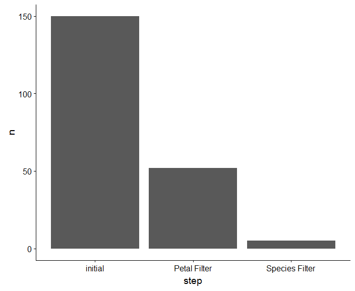

# Tidystairs

Tidystairs is a package to keep track of the dimensions of the dataframe while
filtering per diferent values in a dplyr pipe. 

You can add at each step a name to recognise that filter.

```
library(cowplot)
ir = iris %>% create_stairs() %>%
  set_stairs(name = "initial") %>%
  dplyr::filter(Petal.Width > 1.5) %>%
  set_stairs(name = "Petal Filter") %>% 
  dplyr::filter(Species %in% c("versicolor")) %>% 
  set_stairs(name = "Species Filter")

plot_stairs(ir)
```

